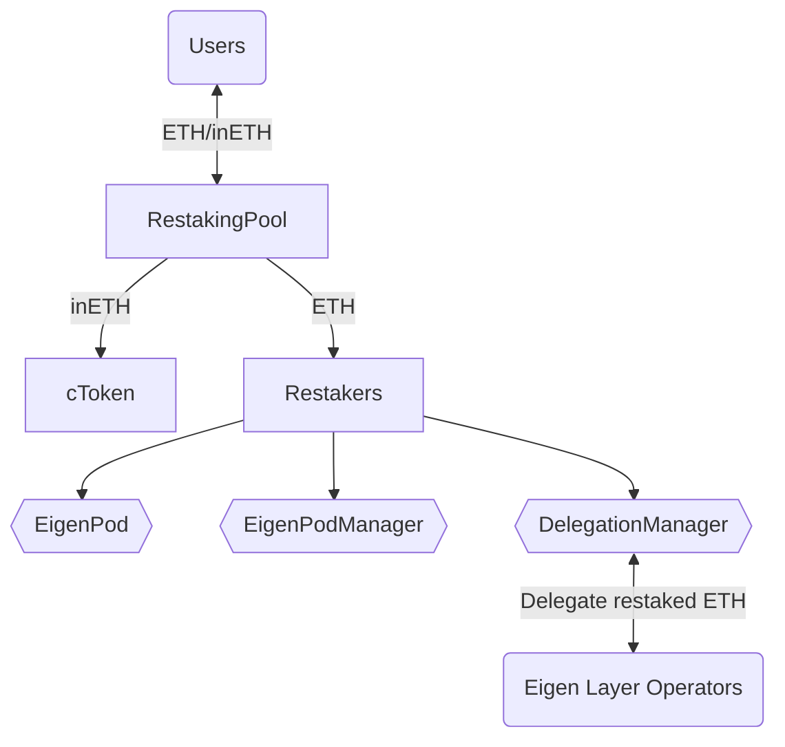

# InceptionLRT V2 (ex. GenesisLRT)

# TODO

[Website](https://www.genesislrt.com/) | [Docs](https://docs.genesislrt.com/)

## Overview

InceptionLRT V2 liquid restaking is implemented as a collection of smart contracts, both InceptionLRT and third-party (EigenLayer).
The product supports ETH as the input asset to stake it to Beacon Chain and enable restaking mechanics using EigenLayer to produce extra rewards to the users.



### Contracts

#### Inception(ex. Genesis)

- **cToken** - implementation of inETH token; not rebased.
- **RestakingPool** - the pool that implements such features as exchange ETH to inETH and vice versa; owner of Restakers assigned to different providers.
- **RatioFeed** - contract stores ratio between ETH and inETH.
- **ProtocolConfig** - contract stores general variables of liquid restaking protocol.
- **FeeCollector** - contract receives Tips & Mev rewards for produced blocks. Must be set as --fee-recipient in validator client.
- **RestakerBeacon** - beacon of Restaker.
- **Restaker** - owner and deployer of EigenPod; Restaker features transferable ownership.
- **RestakerFacets** - contract stores dependencies between method signature and target contract. See [Diamond](https://eips.ethereum.org/EIPS/eip-253).
- **RestakerDeployer** - a contract that deploys instances of the `Restaker` contract.

#### EigenLayer

- **EigenPod** - a contract that serves as the withdrawal credentials for one or more Beacon Chain validators controlled by a `Restaker`. The primary role is to validate Beacon Chain proofs for each of the `Restaker`'s validators.
- **EigenPodManager** — entry point for `EigenPod`.
- **DelegationManager** — a contract that manages delegations to one of EigenLayer Node Operators, where the operators are legal entities who offer to run actively validated services software modules on the stakers' behalf

## Deployments

### Mainnet (M1 compat):

- Restaker Beacon: [0x82d87f4c7171cabb9ac55ae3f60f7d15f595a46a](https://etherscan.io/address/0x82d87f4c7171cabb9ac55ae3f60f7d15f595a46a)
- ProtocolConfig: [0x81b98D3a51d4aC35e0ae132b0CF6b50EA1Da2603](https://etherscan.io/address/0x81b98D3a51d4aC35e0ae132b0CF6b50EA1Da2603)
- RatioFeed: [0x122ee24Cb3Cc1b6B987800D3B54A68FC16910Dbf](https://etherscan.io/address/0x122ee24Cb3Cc1b6B987800D3B54A68FC16910Dbf)
- cToken: [0xf073bAC22DAb7FaF4a3Dd6c6189a70D54110525C](https://etherscan.io/address/0xf073bAC22DAb7FaF4a3Dd6c6189a70D54110525C)
- RestakingPool: [0x46199cAa0e453971cedf97f926368d9E5415831a](https://etherscan.io/address/0x46199cAa0e453971cedf97f926368d9E5415831a)
- FeeCollector: [0xf403eb7B69F6c7Ab73BBaeF42AFE87c0a61a15D0](https://etherscan.io/address/0xf403eb7B69F6c7Ab73BBaeF42AFE87c0a61a15D0)
- RestakerFacets: [0x161Cd8fD2694D220e246854E177B726D8E36971d](https://etherscan.io/address/0x161Cd8fD2694D220e246854E177B726D8E36971d)
- RestakerDeployer: [0x10ccB7aFb5C2C20fffA38eAf1FbC99db571Bf57A](https://etherscan.io/address/0x10ccB7aFb5C2C20fffA38eAf1FbC99db571Bf57A)

### Holesky (M2 compat):

- Restaker Beacon: [0x6892281113639621cFaac3469F0B7FC60c2A2fF0](https://holesky.etherscan.io/address/0x6892281113639621cFaac3469F0B7FC60c2A2fF0)
- ProtocolConfig: [0xe59e4410d1D4C364b506F09aBe942b97f1c7b912](https://holesky.etherscan.io/address/0xe59e4410d1D4C364b506F09aBe942b97f1c7b912)
- RatioFeed: [0x3e329e6782C7d8496DE49e79CD36D1aA592D493b](https://holesky.etherscan.io/address/0x3e329e6782C7d8496DE49e79CD36D1aA592D493b)
- cToken: [0x76944d54c9eF0a7A563E43226e998F382714C92f](https://holesky.etherscan.io/address/0x76944d54c9eF0a7A563E43226e998F382714C92f)
- RestakingPool: [0xEAA6d9f33c7095218Ed9cD4f0D7FB6551A14005f](https://holesky.etherscan.io/address/0xEAA6d9f33c7095218Ed9cD4f0D7FB6551A14005f)
- FeeCollector: [0x350744AAa70aa8a45A860b64e48c910ceAC72cc4](https://holesky.etherscan.io/address/0x350744AAa70aa8a45A860b64e48c910ceAC72cc4)
- RestakerFacets: [0x655cae54f8bcb718275c7719259dc359d8253C62](https://holesky.etherscan.io/address/0x655cae54f8bcb718275c7719259dc359d8253C62)
- RestakerDeployer: [0x527BAA531B64BCB80cf9369DD1b1BD3CCCdDAeab](https://holesky.etherscan.io/address/0x527BAA531B64BCB80cf9369DD1b1BD3CCCdDAeab)

## Installation

### Prerequisites

- Node: v16+

### Tasks

#### Compilation

`yarn hardhat compile`

#### Tests

`yarn hardhat test`

#### Deploy

`yarn hardhat deploy`

### Verification

Verification of deployed by RestakerDeployer BeaconProxy

```bash
yarn hardhat verify <BeaconProxy> <beacon> 0x --network mainnet --contract @openzeppelin/contracts/proxy/beacon/BeaconProxy.sol:BeaconProxy
```
